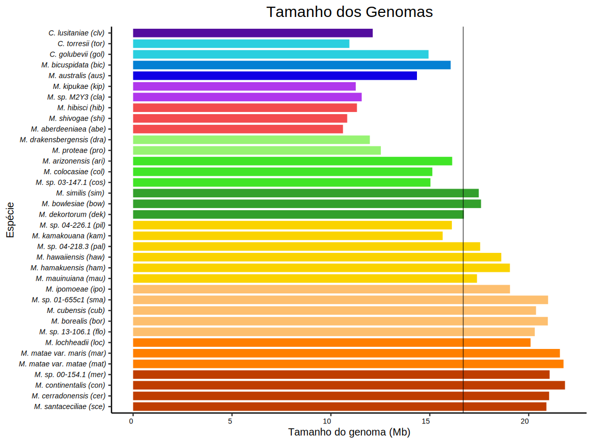

Yeast genome analysis pipeline used in *Heron Hilário* PhD Thesis
=======
*Metschikowia* genome analysis pipeline* 

================
#### used in *Heron Hilário* PhD Thesis
Heron O. Hilário
15/03/2020

This pipeline was adapted and complemented from [github.com/sujaikumar/assemblage](http://github.com/sujaikumar/assemblage), 
customized for *Metschnikowia australis* and other *Metchnikowia* genomes analysis performed for my PhD Thesis. 

**NOTE: if you wish to run this pipeline for your genomes it is recommended to use up to date versions of the listed programs.**
**NOTE2: as my mentor Prof. Thiago Mafra always told me, "RTFM" (Read The Friendly Manual) **

# Assembly
## reads quality assessment, trimming and genome assembly
### FastQC for visualization of reads quality

*M. australis* WGS reads from MiSeq and HiSeq platforms
``` bash
fastqc -f fastq -o . aus_miseq_001.fastq aus_miseq_002.fastq aus_hiseq_001.fastq aus_hiseq_002.fastq ;
```
Open html output on web browser.

### TRIMMOMATIC for removal of adpter and poor quality reads

Leaving only reads with phred score above 30.

#### MiSeq reads
``` bash
java -jar trimmomatic-0.38.jar PE -phred64 -threads 16 \
 aus_miseq_001.fastq aus_miseq_002.fastq \
 aus_miseq_001_P_trim.fastq aus_miseq_001_U_trim.fastq \
 aus_miseq_002_P_trim.fastq aus_miseq_002_U_trim.fastq \
 ILLUMINACLIP:$home/Trimmomatic-0.38/adapters/NexteraPE-PE.fa:2:30:30 \
 LEADING:3 TRAILING:3 SLIDINGWINDOW:5:20 MINLEN:50 ;
```
#### HiSeq reads
``` bash
java -jar trimmomatic-0.38.jar PE -phred64 -threads 16 \
 aus_hiseq_001.fastq aus_hiseq_002.fastq \
 aus_hiseq_001_P_trim.fastq aus_hiseq_001_U_trim.fastq \
 aus_hiseq_002_P_trim.fastq aus_hiseq_002_U_trim.fastq \
 ILLUMINACLIP:$home/Trimmomatic-0.38/adapters/NexteraPE-PE.fa:2:30:30 \
 LEADING:3 TRAILING:3 SLIDINGWINDOW:4:20 MINLEN:50 ;
```
### FastQC for visualization of trimmed reads quality

``` bash
fastqc -f fastq -o . aus_hiseq_001_P_trim.fastq aus_hiseq_001_U_trim.fastq \
 aus_hiseq_002_P_trim.fastq aus_hiseq_002_U_trim.fastq \
 aus_miseq_001_P_trim.fastq aus_miseq_001_U_trim.fastq \
  aus_miseq_002_P_trim.fastq aus_miseq_002_U_trim.fastq ;
```
Open html output on web browser.

### Genome assembly with SPADES 3.9.0

``` bash
spades.py \
 -k 21,33,55,77 \
 --careful \
 -t 64 \
 --pe1-1 aus_miseq_001_P_trim.fastq \ 
 --pe1-2 aus_miseq_002_P_trim.fastq \
 --pe2-1 aus_hiseq_001_P_trim.fastq \
 --pe2-2 aus_hiseq_002_P_trim.fastq \
 --s1 aus_miseq_001_P_trim.fastq \
 --s2 aus_miseq_002_P_trim.fastq \
 --s3 aus_hiseq_001_U_trim.fastq \
 --s4 aus_hiseq_002_U_trim.fastq \
 -o ~/genome_assembly/aus/ ;
```

##### **From here on, all steps were performed equally to all 36 genomes analyzed. All genomes were renamed with a three letter code to facilitate parallel processment. When possible,  bash scripts were written with the *for* command, in order to homogenize analysis and avoid errors scince the same commands were run for every $genome**


## Assembly quality assessment
### Scaffold and contigs statistics with scaffold_stats.pl

Contig metrics with scaffold_stats.pl by github.com/sujaikumar 
``` bash
scaffold_stats.pl -f aus_contigs.fasta -t 500 1000 -o aus_contigs_stats.txt;
```
### Genome completeness assessment with CEGMA 2.5

``` bash
cegma -g $genome.fasta -T 16 -o ~/.../cegma_out/$genome_cegma;
```

### Genome completeness assessment with BUSCO

Run BUSCO and then read the short summary file for completeness report.
``` bash
mkdir busco_out;
cd busco_out;
python ~/.../busco_v2/BUSCO.py -i $genome.fasta -l ~/.../busco/saccharomyceta_odb9/ -o $genome -m geno;
cat run_$genome/short_summary_$genome.txt
```

### Masking and counting repeats proprotion with RepeatMasker
``` bash
mkdir rptmsk_out;
cd rptmsk_out;
RepeatMasker -pa 16 -species fungi -s -noisy \
-dir ~/.../repeatMasker/ \
-html -small -lcambig -gccalc ~/.../genomes/$genome.fasta;
cat $genome.fasta.tbl;
html $genome.fasta.html;
```

# Annotation
## Gene Prediction and Annotation

### Running GeneMark-ES to construct HMMs for maker
``` bash
mkdir gm_out;
cd gm_out;
gmes_petap.pl --sequence ~/.../genomes/$genome.fasta --ES --fungus;
```

### Convert CEGMA gff output into HMM for maker

Conversion using SNAP scripts

``` bash
mkdir gff_cegma;
cd gff_cegma;
cegma2zff ~/.../cegma_out/$genome.cegma.gff ~/.../genomes/$genome.fasta; 
fathom genome.ann genome.dna -categorize 1000; 
fathom -export 1000 -plus uni.ann uni.dna; 
forge export.ann export.dna; 
hmm-assembler.pl ~/.../genomes/$genome.fasta . > \ 
 ~/.../gff_cegma/$genome.cegmasnap.hmm;
```

### AUGUSTUS new species training for MAKER2

As AUGUSTUS closest species to *Metschnikowia* is *Pichia stipitis*, I decided to train it for *Clavispora lusitaniae*,
more closely related and with transcriptomic data available.

   **note** *now there is a web service to do so* (augustus web training)[http://bioinf.uni-greifswald.de/webaugustus/training/create]
Genome and Transcriptome data were downloaded from NCBI:Genome and SRA for this purpose.

#### Genome assembly and transcriptome download

Dowloading *C. lusitaniae* genome assembly and genome *.gff*
``` bash
wget ftp://ftp.ncbi.nlm.nih.gov/genomes/all/GCF/000/003/835/GCF_000003835.1_ASM383v1/GCF_000003835.1_ASM383v1_genomic.fna.gz
wget ftp://ftp.ncbi.nlm.nih.gov/genomes/all/GCF/000/003/835/GCF_000003835.1_ASM383v1/GCF_000003835.1_ASM383v1_genomic.gbff.gz
```
Extract genome and *.gff*  and rename files to a simpler code (ie: clv)

<<<<<<< HEAD


``` r
cat("teste")
=======
Downloading transcriptome raw reads data from SRA
``` bash
fasterq-dump  SRR2141707.sra -s
```

#### Transcriptome alignment to genome
``` bash
STAR --runThreadN 64 \
 --genomeDir ~/.../genomes/clv/ \
 --readFilesIn \
 ~/.../reads/SRR2141707_1.fastq \
 ~/.../reads/SRR2141707_2.fastq \
 --runMode alignReads \
 --outFileNamePrefix RNA_clv \ 
 --sjdbGTFfile ~/.../genomes/gff/clv_genome.gff \
 --outSJfilterReads Unique \
 --genomeLoad NoSharedMemory \
 --outFilterType BySJout \
 --outFilterMultimapNmax 20 \
 --outFilterMismatchNmax 999 \
 --outSAMtype BAM SortedByCoordinate \
 --alignSJoverhangMin 8 \
 --alignSJDBoverhangMin 3 \
 --alignIntronMin 20 \
 --outSAMattributes All \
 --quantMode;
>>>>>>> 2318e183b330ebf7c13535b2d688b9e007a2d5c5
```

#### AUGUSTUS training for new species


The *.bam* file generated by STAR was converted into *hints* (*.gff*) using AUGUSTUS' script *bam2hints*

``` bash
bam2hints --in=RNA_clv.bam --out=clv_RNA_hints.gff
```
In order to train and test is required to ramdomly split genome into train and test sets whit AUGUSTUS' *randomSplit.pl*
**5** refers to five contigs to be taken out of the total **9**

``` bash
randomSplit.pl clv_genome.gbff 5
```

The outputs are 2 *.gff* files refering to *test* and *train* sets. The latter was used as input with genome file to AUGUSTUS' *autoAug.pl*

``` bash
autoAug.pl --genome=~/.../genomes/clv_genome.fasta \ 
 --trainingset=~/.../augustus_trainer/clv_genome.gbff.train \
 --species=clavispora_lusitaniae \
 --hints=~/.../clv_RNA_hints.gff \
 --verbose --index=1;
```
The new AUGUSTUS species ID was **clavispora_lusitaniae** 

#### AUGUSTUS testing for new species

Despite given an *.gff*, AUGUSTUS use only the *fasta* sequence at its end.

``` bash
augustus --species=clavispora_lusitaniae ~/.../clv_genome.gbff.test 
```
Once confirmed the predictive capacity the new species was used in MAKER2 predictions

### Gene prediction with MAKER2

<<<<<<< HEAD
use TRIMOMMATIC to remove low quality reads and trimm low quality
segments (phred \< 30) from sequencer output \# 2.
=======
MAKER2 was run in two iterations. 
The first, only with HHM profiles generated by SNAP and GeneMark and customized AUGUSTUS species.
The second with the *.gff* files generated by the first and with a new SNAP HMM profile made on the first prediction.
This second round improved predicted CDSs on ~20%.
>>>>>>> 2318e183b330ebf7c13535b2d688b9e007a2d5c5

#### **1st Iteration**
##### Generate and fill **MAKER2 config files** and run MAKER2

``` bash
mkdir ~/.../maker_run/1pass/$species;
cd ~/.../maker_run/1pass/$species
maker -CTL
```

Three files were created in the folder and customized for prediction. 
The most important to customize is *maker_opts.ctl* since it is where to fill with *$genome file, $snaphmm file, $gmhmmfile* created before and model_org assigned to **FUNGI** for RepeatMasker. Any other EST, transcriptomic, closest species data you may have can be used, but this was not the case for *Metschnikowia*.

``` bash
maker
```
On the MAKER output dir the predictions made with AUGUSTUS, SNAP and GM were merged with MAKER2' scripts *fasta_merge* and *gff3_merge*

``` bash
cd ~/.../1pass/$genome.maker.output;
fasta_merge -d $genome_master_datastore_index.log;
gff3_merge -d $genome_master_datastore_index.log;
```

Use *grep* to count the number of predicted CDSs

``` bash
grep -c ">" $genome.all.maker.*.fasta
```

##### Run SNAP on 1st MAKER2 generated *.gff*

``` bash
maker2zff -n $genome.all.gff;
fathom genome.ann genome.dna -categorize 1000;
fathom -export 1000 -plus uni.ann uni.dna ;
forge export.ann export.dna;
hmm-assembler.pl $genome . > ../$genome.hmm;
```
The generated *$genome.hmm* now replaces the first SNAP HMM profile mado on CEGMA results on the sec.

#### **2nd Iteration**
##### Generate and fill **MAKER2 config files** and run MAKER2

``` bash
mkdir ~/.../maker_run/2pass/$species;
cd ~/.../maker_run/2pass/$species
maker -CTL
```
Fill the the *maker_opts.ctl* file with the same information given at first iteration,
replacing *snaphmm* and filling *maker_gff* with the *gff* generated at the end of the first iteration.
Run maker.

``` bash
maker
```
On the MAKER output dir the predictions made with AUGUSTUS, SNAP and GM were merged with MAKER2' scripts *fasta_merge* and *gff3_merge*

``` bash
cd ~/.../2pass/$genome.maker.output;
fasta_merge -d $genome_master_datastore_index.log;
gff3_merge -d $genome_master_datastore_index.log;
```

Use *grep* to count the number of predicted CDSs

``` bash
grep -c ">" $genome.all.maker.*.fasta
```

Maker CDSs have long bulky names so they were all renamed on *fasta* and *gff*


### Predicting tRNAs with tRNAscan-SE v2.0

Run tRNAscan for eukaryotic RNAs, with general tRNA models and generating summary, structures and sequences files.

``` bash
mkdir ~/.../tRNAscan_out;
cd ~/.../tRNAscan_out;
tRNAscan-SE -E -G -o $genome_trnas -f $genome_trnas_2ndStruc -m $genome_trnas_stats  ~/.../genomes/$genome.fasta
```

### Functional annotation with InterProScan

``` bash
java -jar interproscan-5.jar --iprlookup -dp  --pathways  --goterms  --input /home/heron-oh/metschnikowias/2018/maker_metsch/2pass/aus/aus.maker.output/aus.all.maker.proteins.fasta  -u /home/heron-oh/metschnikowias/2018/interproscan/aus -f TSV,SVG -b aus -cpu 32
```
