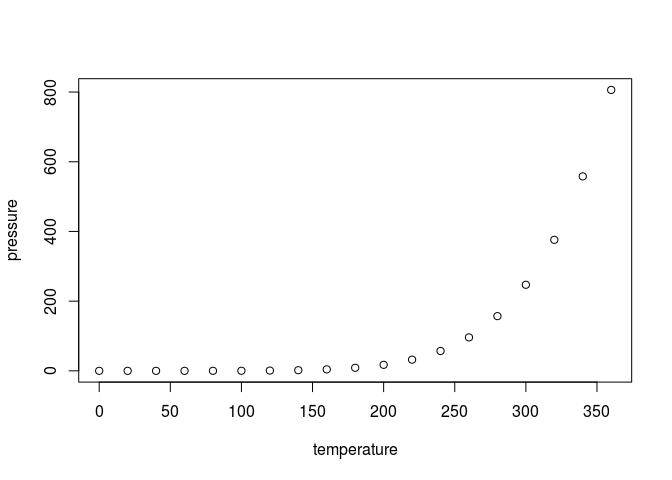

Yeast genome analysis pipeline\* used in *Heron Hilário* PhD Dissertation
================
Heron O. Hilário
15/03/2020

# Assembly

``` r
cat("teste")
```

    ## teste

``` bash

cat /home/heron-oh/metschnikowias/2020/36_metsch_IDs.list
```

    ## abe
    ## ari
    ## aus
    ## bic
    ## bor
    ## bow
    ## cer
    ## cla
    ## clv
    ## col
    ## con
    ## cos
    ## cub
    ## dek
    ## dra
    ## flo
    ## gol
    ## ham
    ## haw
    ## hib
    ## ipo
    ## kam
    ## kip
    ## loc
    ## mar
    ## mat
    ## mau
    ## mer
    ## pal
    ## pil
    ## pro
    ## sce
    ## shi
    ## sim
    ## sma
    ## tor

``` r
source("FINAL_metsch_pipeline.R")
```

# 1\. Avaliação da qualidade das *reads*

use TRIMOMMATIC to remove low quality reads and trimm low quality
segments (phred \<30) from sequencer output \# 2.

## Markdown

This is an R Markdown document. Markdown is a simple formatting syntax
for authoring HTML, PDF, and MS Word documents. For more details on
using R Markdown see <http://rmarkdown.rstudio.com>.

When you click the **Knit** button a document will be generated that
includes both content as well as the output of any embedded R code
chunks within the document. You can embed an R code chunk like this:

``` r
summary(cars)
```

    ##      speed           dist       
    ##  Min.   : 4.0   Min.   :  2.00  
    ##  1st Qu.:12.0   1st Qu.: 26.00  
    ##  Median :15.0   Median : 36.00  
    ##  Mean   :15.4   Mean   : 42.98  
    ##  3rd Qu.:19.0   3rd Qu.: 56.00  
    ##  Max.   :25.0   Max.   :120.00

## Including Plots

You can also embed plots, for
example:

<!-- -->

Note that the `echo = FALSE` parameter was added to the code chunk to
prevent printing of the R code that generated the plot.
